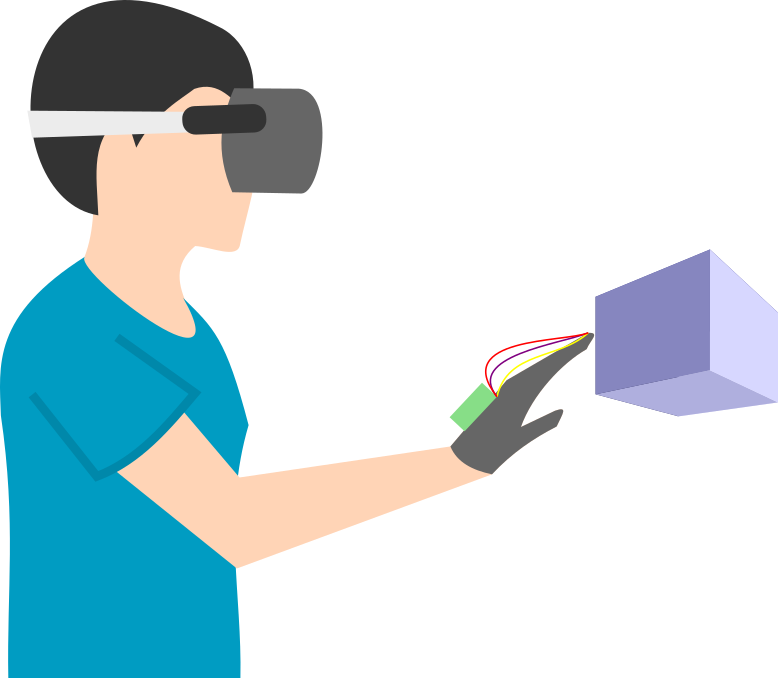

## Glovatics

A haptic feedback for the sense of touch.
This project was to create a virtual realistic sense of touch by installing small vibrators in the tip of the gloves.
The system will bi implemented in Oculus Quest 2.

So far, the development of the gloves has been finished.